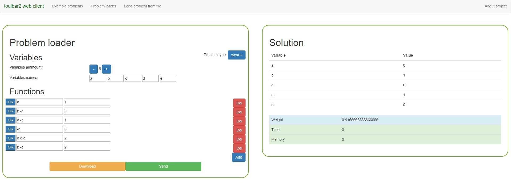
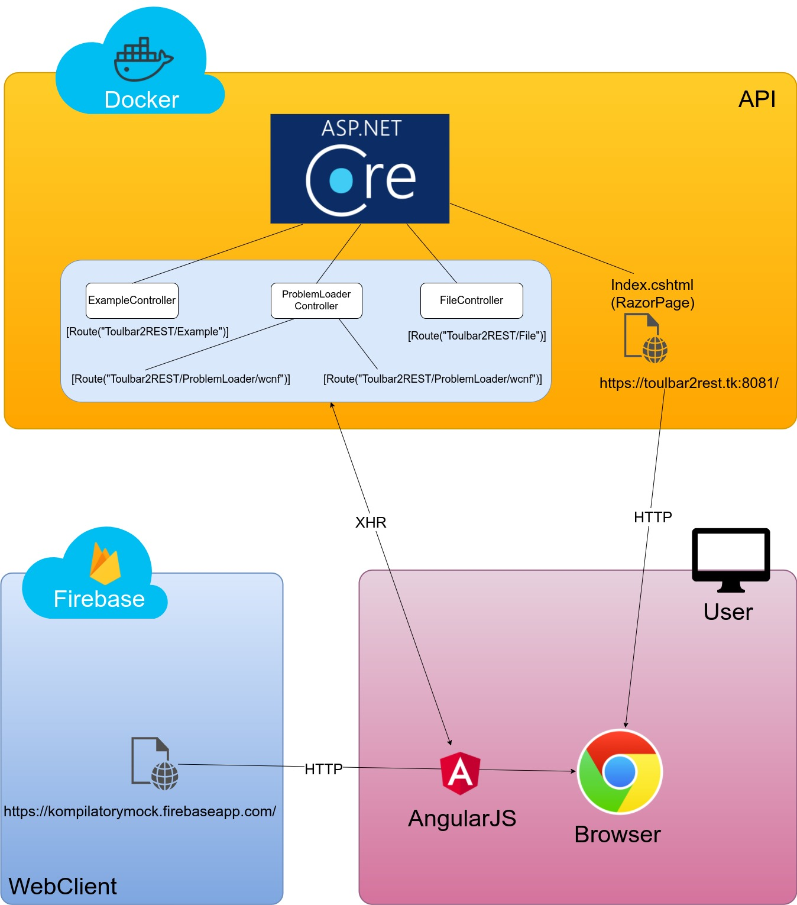

# toulbar2 REST

## About application

Main idea was to create user-friendly interface for **Toulbar2**. It is an open-source _C++_ solver for cost function networks. It solves various combinatorial optimization problems.
More info about _Toulbar2_ can be find here: http://www7.inra.fr/mia/T/toulbar2/

Interface for the solver is available here:

 - website: https://kompilatorymock.firebaseapp.com/solver/loader
 - github: https://github.com/tomaboro/toulbar2-webfrontend

We decided to focus on two kinds of problems - Weighted Constraint Satisfactory Problem (_wcsp_) and Weighted Conjunctional Normal Form problem (_wcnf_).
This application is a _.NET Core_ server, which runs in docker on our server. Its main task can be write in four steps:
1. Use parameters from REST query to create a file with problem
2. Run _Toulbar2_ using created file to solve particular problem
3. Filter output from solver to get solution alongside with time spent on solving, memory consumption and percentage of rules that are satisfied
4. Return JSON with filtered parameters

## Creating problem using website

For now only wcnf problems works correctly, but we are working hard to make solving wcsp problems works too :)

To solve your own wcnf problem:

1. If you never heard of CNF notation go to https://en.wikipedia.org/wiki/Conjunctive_normal_form
2. Go to page https://kompilatorymock.firebaseapp.com/solver/loader
3. As problem type select _wcnf_
4. Select amount of variables and give them names
5. Create as many functions as you want:
	- in each line you should write your variable names separated with spaces
	- each function represents one formula with OR between variables
	- if you want to negate variable then add "-" before it
	- example should be more helpful probably:
	  if you want to create "a OR b OR NOT(c)" formula then you need to write "a b -c"
6. Add weight to all functions
7. Finally click send button to solve your problem :)

Example wcnf problem and solution:

Website is still in the experimental stage so not all fuctionalities may work correctly.

## Architecture

## Prerequisites

1. Go to **certs** directory and rename **key.pfx.example** to **key.pfx**.
2. Add following line to **hosts** file (/etc/hosts in Linux):
~~~
127.0.1.1   t2r.localhost
~~~

## Running container

1. Run command:

    $ docker-compose up --build

2. Wait for server start with message as following:

~~~
soa                 | Now listening on: http://[::]:8080          
soa                 | Now listening on: https://[::]:8081
soa                 | Application started. Press Ctrl+C to shut down.
~~~

3. Open https://t2r.localhost

## Notes

All files are watched and every changed is reloaded within few seconds.
